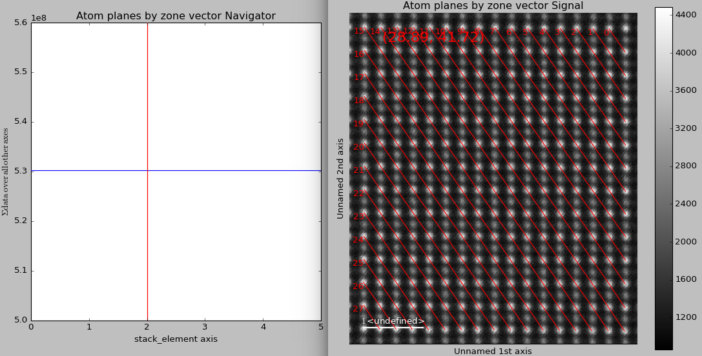

.. _analysing_atom_lattices:

=======================
Analysing atom lattices
=======================

After finding and refining the atom lattices as shown in :ref:`finding_atom_lattices`, the atomic structure can be analysed through

1. Ellipticity of the atomic columns
2. The distance between neighbouring atoms
3. Monolayer separation
4. (Intensity)

In this tutorial we will use a dummy image containing two sublattices.
Different structural distortions have been introduced in the image, and this tutorial will study these distortions.
The plots that are made are simple plots that clearly shows the structural change of the sublattices.
It is also possible to make more fancy for publications (such as in the paper presenting `Atomap <https://dx.doi.org/10.1186/s40679-017-0042-5>`_), and some tips for doing this will be presented at the end of this tutorial.

Fantasite, the dummy structure
==============================

The procedure for finding and refining the sublattices is similar as in :ref:`finding_atom_lattices` (link to section).

.. code-block:: python

    >>> import atomap.api as am
    >>> from atomap.tools import remove_atoms_from_image_using_2d_gaussian
    
    >>> s = am.dummy_data.get_fantasite()
    >>> A_positions = am.get_atom_positions(s,separation=16)
    >>> sublattice_A = am.Sublattice(A_positions,image=s.data, color='r', name='A')
    >>> sublattice_A.find_nearest_neighbors()
    >>> sublattice_A.refine_atom_positions_using_center_of_mass()
    >>> sublattice_A.refine_atom_positions_using_2d_gaussian()
    >>> sublattice_A.construct_zone_axes()
    
    >>> direction_001 = sublattice_A.zones_axis_average_distances[1]
    >>> B_positions = sublattice_A._find_missing_atoms_from_zone_vector(direction_001)
    >>> image_without_A = remove_atoms_from_image_using_2d_gaussian(sublattice_A.image, sublattice_A)
    
    >>> sublattice_B = am.Sublattice(B_positions, image_without_A, color='blue', name='B')
    >>> sublattice_B.construct_zone_axes()
    >>> sublattice_B.refine_atom_positions_using_center_of_mass()
    >>> sublattice_B.refine_atom_positions_using_2d_gaussian()
    >>> atom_lattice = am.Atom_Lattice(image=s.data, name='fantasite', sublattice_list=[sublattice_A, sublattice_B])
    >>> atom_lattice.save("fantasite.hdf5", overwrite=True)
    >>> s.plot() 
    >>> atom_lattice.plot()

.. image:: images/plotting_tutorial/fantasite.png
    :scale: 50 %

.. image:: images/plotting_tutorial/atom_lattice.png
    :scale: 50 %

Fantasite is shown in the left image, and it is possible to see some variations in ellipticity and atom positions with the naked eye.
The right figure shown the atom positions after refinement.
As refinement of the sublattice can be time consuming, it is a good idea to save the final atom lattice.

Load atom lattice
===================
The atom lattice can be loaded:

.. code-block:: python

    >>> import atomap.api as am
    >>> atom_lattice = am.load_atom_lattice_from_hdf5("fantasite.hdf5")
    >>> atom_lattice  # doctest: +SKIP
    <Atom_Lattice, fantasite (sublattice(s): 2)> # doctest: +SKIP
    >>> atom_lattice.sublattice_list  # doctest: +SKIP
    [<Sublattice,  (atoms:104,planes:6)>, <Sublattice,  (atoms:91,planes:6)>]  # doctest: +SKIP
    >>> image = atom_lattice.image0

`Atom_Lattice` is an object containing the sublattices, and other types of information.
The fantasite atom lattice contains two sublattices (red and blue dots in the image above).
Atom positions, sigma, ellipticity and rotation for the atomic columns in a sublattice can be accessed.

.. code-block:: python

    >>> sublattice_A = atom_lattice.sublattice_list[0]
    >>> x = sublattice_A.x_position
    >>> y = sublattice_A.y_position
    >>> sigma_x = sublattice_A.sigma_x
    >>> sigmal_y = sublattice_A.sigma_y
    >>> ellipticity = sublattice_A.ellipticity
    >>> rotation = sublattice_A.rotation_ellipticity

Ellipticity
===========

Elliptical atomic columns may occur when atoms parallell to the electron beam have sifted position in the plane orthagonal to the beam.
In the image, circular atomic columns have an ellipticity of 1, as `sigma_x`  = `sigma_y`.

.. math::

   e = \sigma_x / \sigma_y ,  \sigma_x > sigma_y
   e = \sigma_y / \sigma_x ,  \sigma_y > sigma_x

Ellipticity maps
----------------
The ellipticity map shows the magnitude of the ellipticity.
Values are interpolated, giving a continous map.
The sublattice B was generated without any ellipticity, and the image to the right showing B is farily flat.
In sublattice A, a region with elliptical atomic columns is clearly visible.
The ellipticity also increases from left to right towards a maximum, before it starts to fall agian.
This is perfectly in line with how the dummy image of fantasite has been generated.

.. code-block:: python

    >>> sublattice_A = atom_lattice.sublattice_list[0]
    >>> sublattice_B = atom_lattice.sublattice_list[1]
    >>> sublattice_A.plot_ellipticity_map(cmap='viridis',vmin=0.95,vmax=1.3)
    >>> sublattice_B.plot_ellipticity_map(cmap='viridis',vmin=0.95,vmax=1.3)

.. image:: images/plotting_tutorial/ellipticity_map_A.png
    :scale: 50 %
    
.. image:: images/plotting_tutorial/ellipticity_map_B.png
    :scale: 50 %

Vector plots
------------
While the ellipticity map nicely visualizes the magnitude of the ellipticity, it does not show the direction of the ellipse.
In vector (quiver) plots both the rotation and magnitude are visualized, through the length and angle of the arrows.

.. code-block:: python

    >>> sublattice_A.plot_ellipticity_vectors()

.. image:: images/plotting_tutorial/ellipticity_vectors.png
    :align: center
    :scale: 50 %

Projection of ellipticity
-------------------------

When the noise level in an atomic resolution image is high, it can be useful to integrate the image by projecting the properties on a single monolayer.

Distance between monolayers
===========================

As Atomap knows the positins of all atoms, it can also tell you if you have strain (link to Wenner paper) or other types of structural distortion (link to Hallsteinsen paper), that alters the distance between atoms and monolayers.

In this example, Atomap finds the distance between monolayers (define this).
`s_monolayer`is a hyperspy signal stack, where the navigation axis is zone vector and signal axes is monolayer separation.
`get_monolayer_distance_map` (ref) can also take in a subset of zone vectors, but the default is to find the monolayer separation for all the zone axis.

.. code-block:: python

    >>> s_monolayer = sublattice_B.get_monolayer_distance_map()
    >>> s_monolayer.plot(cmap='viridis')

.. image:: images/plotting_tutorial/Sublattice_B_monolayer_distance_a.png
    :scale: 50 %

.. image:: images/plotting_tutorial/Sublattice_B_monolayer_distance_b.png
    :scale: 50 %

The left image shows the monolayer separation for one zone axis, namely the separation between the monolayers drawn up by red lines in the right figure.
Clearly, the position of the B atomic columns are changed in the middle of the image, where every second atom (monolayer) is closer and more far aparat. 

Visualize structural properties
===============================

These signals can be saved by using the inbuilt `save` function in the signals.

.. code-block:: python

    >>> s_monolayer.save("monolayer_distances.hdf5",overwrite=True) # doctest: +SKIP

The `sublattice` objects also contain a list of all the atomic planes:

.. code-block:: python

    >>> atom_plane_list = sublattice.atom_plane_list # doctest: +SKIP

The `atom_plane` objects contain the atomic columns belonging to the same specific plane.
Atom plane objects are defined by the direction vector parallel to the atoms in the plane, for example (58.81, -41.99).
These can be accessed by:

.. code-block:: python

    >>> atom_plane = atom_plane_list[0] # doctest: +SKIP
    >>> atom_list = atom_plane.atom_list # doctest: +SKIP
    
The atom planes can be plotted by using the `get_all_atom_planes_by_zone_vector` function, where the zone vector is changed by using the left-right arrow keys:

.. code-block:: python

    >>> sublattice.get_all_atom_planes_by_zone_vector().plot() # doctest: +SKIP

The `atom_position` objects contain information related to a specific atomic column.
For example:

.. code-block:: python

    >>> atom_position = sublattice.atom_list[0] # doctest: +SKIP
    >>> x = atom_position.pixel_x # doctest: +SKIP
    >>> y = atom_position.pixel_y # doctest: +SKIP
    >>> sigma_x = atom_position.sigma_x # doctest: +SKIP
    >>> sigma_y = atom_position.sigma_y # doctest: +SKIP
    >>> sublattice.plot() # doctest: +SKIP

Plotting for publication
========================

Please consider to cite Atomap

Saving specific data
--------------------

When making advaced figures containing specific data for publication, it can be a good idea to save this data for example in separate numpy files.
This makes it quick to load the data when using for example matplotlib to make figures.

.. code-block:: python

    >>> import numpy as np
    >>> np.savez("datafile.npz", x=sublattice_A.x_position, y=sublattice_A.y_position)

Alternatively, the data can  ve saved in comma-separated values (CSV) file, which can be opened in spreadsheet software:

.. code-block:: python

    >>> np.savetxt("datafile.csv", (sublattice_A.x_position, sublattice_A.y_position, sublattice_A.sigma_x, sublattice_A.sigma_y, sublattice_A.ellipticity), delimiter=',')
