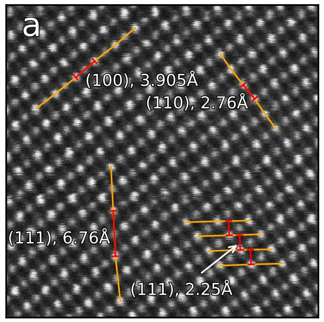
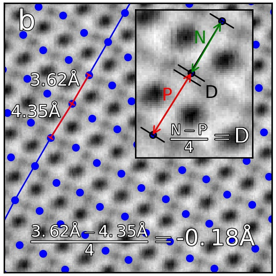

.. _analysing_atom_lattices:

=======================
Analysing atom lattices
=======================

After finding and refining the atom lattices as shown in :ref:`finding_atom_lattices`, the atomic structure can be analysed through

1. :ref:`Ellipticity of the atomic columns <getting_ellipticity>`
2. :ref:`Monolayer separation <getting_monolayer_distance>`
3. :ref:`Angle between monolayers <getting_angle_atoms>`
4. :ref:`Integration of Atomic Columns <integrate>`
5. :ref:`Making line profiles <making_line_profiles>`

In this tutorial we will use a dummy image containing two sublattices.
Different structural distortions have been introduced in the image, and this tutorial will study these distortions.
The plots that are made are simple plots that clearly shows the structural changes in the sublattices.
It is also possible to make more fancy figures for publications (such as in the paper presenting `Atomap <https://dx.doi.org/10.1186/s40679-017-0042-5>`_), and some tips for doing this are shown in the :ref:`plotting section of the guide <making_nice_figures>`.

Fantasite, the dummy structure
==============================

The procedure for finding and refining the sublattices in fantasite is similar as in :ref:`Images with more than one sublattice`.

.. code-block:: python

    >>> import atomap.api as am
    >>> from atomap.tools import remove_atoms_from_image_using_2d_gaussian

    >>> s = am.dummy_data.get_fantasite()
    >>> A_positions = am.get_atom_positions(s, separation=12, pca=True)
    >>> sublattice_A = am.Sublattice(A_positions, image=s.data, color='r', name='A')
    >>> sublattice_A.find_nearest_neighbors()
    >>> sublattice_A.refine_atom_positions_using_center_of_mass()
    >>> sublattice_A.refine_atom_positions_using_2d_gaussian()
    >>> sublattice_A.construct_zone_axes()

    >>> direction_001 = sublattice_A.zones_axis_average_distances[1]
    >>> B_positions = sublattice_A.find_missing_atoms_from_zone_vector(direction_001)
    >>> image_without_A = remove_atoms_from_image_using_2d_gaussian(sublattice_A.image, sublattice_A)

    >>> sublattice_B = am.Sublattice(B_positions, image_without_A, color='blue', name='B')
    >>> sublattice_B.construct_zone_axes()
    >>> sublattice_B.refine_atom_positions_using_center_of_mass()
    >>> sublattice_B.refine_atom_positions_using_2d_gaussian()
    >>> atom_lattice = am.Atom_Lattice(image=s.data, name='fantasite', sublattice_list=[sublattice_A, sublattice_B])
    >>> atom_lattice.save("fantasite.hdf5", overwrite=True)
    >>> s.plot()
    >>> atom_lattice.plot()

.. image:: images/plotting_tutorial/fantasite.png
    :scale: 50 %

.. image:: images/plotting_tutorial/atom_lattice.png
    :scale: 50 %

Fantasite is shown in the left image, and it is possible to see some variations in ellipticity and atom positions with the naked eye.
The right figure shows the atom positions after the refinement.
As refinement of the sublattice can be time consuming, it is a good idea to save the final atom lattice.

The `Atom_Lattice` object
=========================

The atom lattice can be loaded:

.. code-block:: python

    >>> import atomap.api as am
    >>> atom_lattice = am.load_atom_lattice_from_hdf5("fantasite.hdf5")
    >>> atom_lattice
    <Atom_Lattice, fantasite (sublattice(s): 2)>
    >>> atom_lattice.sublattice_list # doctest: +SKIP
    [<Sublattice, A (atoms:497,planes:6)>, <Sublattice, B (atoms:465,planes:6)>] # doctest: +SKIP
    >>> image = atom_lattice.image0

:py:class:`atomap.atom_lattice.Atom_Lattice` is an object containing the sublattices, and other types of information.
The fantasite atom lattice contains two sublattices (red and blue dots in the image above).
Atom positions, sigma, ellipticity and rotation for the atomic columns in a sublattice can be accessed via attributes in the sublattice object.

.. code-block:: python

    >>> sublattice_A = atom_lattice.sublattice_list[0]
    >>> x = sublattice_A.x_position
    >>> y = sublattice_A.y_position
    >>> sigma_x = sublattice_A.sigma_x
    >>> sigmal_y = sublattice_A.sigma_y
    >>> ellipticity = sublattice_A.ellipticity
    >>> rotation = sublattice_A.rotation_ellipticity

Similarly, properties of a single atomic column :py:class:`atomap.atom_position.Atom_Position` can be accessed in :py:attr:`atomap.sublattice.Sublattice.atom_list`.
The :py:class:`atomap.atom_position.Atom_Position` object contain information related to a specific atomic column.

.. code-block:: python

    >>> atom_position_list = sublattice_A.atom_list
    >>> atom_position = atom_position_list[0]
    >>> x = atom_position.pixel_x
    >>> y = atom_position.pixel_y
    >>> sigma_x = atom_position.sigma_x
    >>> sigma_y = atom_position.sigma_y

The :py:class:`atomap.atom_plane.Atom_Plane` objects contain the atomic columns belonging to the same specific plane.
Atom plane objects are defined by the direction vector parallel to the atoms in the plane, for example (58.81, -41.99).
These can be accessed by:

.. code-block:: python

    >>> atom_plane_list = sublattice_A.atom_plane_list
    >>> atom_plane = atom_plane_list[0]
    >>> atoms_in_plane_list = atom_plane.atom_list

Atom planes for a specific direction can also be accessed:

.. code-block:: python

    >>> zone_axis0 = sublattice_A.zones_axis_average_distances[0]
    >>> atom_plane_list0 = sublattice_A.atom_planes_by_zone_vector[zone_axis0]

.. _getting_ellipticity:

Ellipticity
===========

Elliptical atomic columns may occur when atoms parallel to the electron beam have shifted position in the plane perpendicular to the beam.
In the image, circular atomic columns have an ellipticity (:math:`\epsilon`) of 1, as `sigma_x`  = `sigma_y` (:math:`\sigma_x = \sigma_y`).
Ellipticity is defined as

.. math::

    \epsilon =
        \begin{cases}
                \frac{\sigma_x}{\sigma_y},& \text{if } \sigma_x > \sigma_y\\
                        \frac{\sigma_y}{\sigma_x},& \text{if } \sigma_y > \sigma_x\\
                            \end{cases}

Ellipticity maps
----------------
The ellipticity map shows the magnitude of the ellipticity.
Values are interpolated, giving a continuous map.
The sublattice B was generated without any ellipticity, and the image to the right is fairly flat, as expected.
In sublattice A, a region with elliptical atomic columns is clearly visible.
The ellipticity gradient is perfectly in line with how the dummy image of fantasite has been generated.
Maps gives nice visualization of gradual change.

.. code-block:: python

    >>> sublattice_A = atom_lattice.sublattice_list[0]
    >>> sublattice_B = atom_lattice.sublattice_list[1]
    >>> sublattice_A.plot_ellipticity_map(cmap='viridis', vmin=0.95, vmax=1.3)
    >>> sublattice_B.plot_ellipticity_map(cmap='viridis', vmin=0.95, vmax=1.3)

.. image:: images/plotting_tutorial/ellipticity_map_A.png
    :scale: 50 %

.. image:: images/plotting_tutorial/ellipticity_map_B.png
    :scale: 50 %

The :py:meth:`atomap.sublattice.Sublattice.plot_ellipticity_map` function calls :py:meth:`atomap.sublattice.Sublattice.get_ellipticity_map`, which calls :py:meth:`atomap.sublattice.Sublattice.get_property_map`.

Vector plots
------------
While the ellipticity map nicely visualizes the magnitude (and gradual change) of the ellipticity, it does not show the direction of the ellipticity.
In vector (quiver) plots (:py:meth:`~atomap.sublattice.Sublattice.plot_ellipticity_vectors`) both the rotation and magnitude are visualized, through the length and angle of the arrows.
There is one arrow for each atom position.
This type of visualization also reveals that the ellipticity of the atomic columns have an alternating directionality.

.. code-block:: python

    >>> sublattice_A.plot_ellipticity_vectors()

.. image:: images/plotting_tutorial/ellipticity_vectors.png
    :align: center
    :scale: 70 %

In this function, a value of 1 is subtracted from the magnitude of the ellipticity.
This makes it easier to study changes in ellipticity, as the 0-point of the plot is set to the perfect circle.
:py:func:`atomap.plotting.plot_vector_field` is called, and this function uses `Matplotlib's quiver plot function <https://matplotlib.org/api/_as_gen/matplotlib.axes.Axes.quiver.html?highlight=quiver#matplotlib.axes.Axes.quiver>`_.

.. _getting_monolayer_distance:

Distance between monolayers
===========================

As Atomap knows the positions of all atoms, it can also tell you if you have any variations in the unit cell sizes or other types of structural distortions.
For example, Atomap has been used to study `oxygen octahedron tilt patterns in perovskite thin films <https://journals.aps.org/prb/abstract/10.1103/PhysRevB.94.201115>`_.

In this example, Atomap finds the distance between monolayers.
"Distance between monolayers" is defined in the figure below (a).
The distance is measured between an atomic column and the nearest monolayer, as shown in this figure.
The values for monolayer separation is attributed to the midpoint of the atom and monolayer.

This is found by using the :py:meth:`~atomap.sublattice.Sublattice.get_monolayer_distance_map`, which returns a stack of `HyperSpy images <http://hyperspy.org/hyperspy-doc/current/user_guide/tools.html>`_.
In this signal the navigation axis is a zone vector (the values in the zone axis tuple are in principle the vector parallel to the monolayer) and the signal axes shows monolayer separation at each atom position.
:py:meth:`~atomap.sublattice.Sublattice.get_monolayer_distance_map` can also take in a subset of zone vectors, but the default is to find the monolayer separation for all the zone axes.

.. code-block:: python

    >>> s_monolayer = sublattice_B.get_monolayer_distance_map()
    >>> s_monolayer.plot(cmap='viridis')

.. image:: images/plotting_tutorial/Sublattice_B_monolayer_distance_a.png
    :scale: 50 %

.. image:: images/plotting_tutorial/Sublattice_B_monolayer_distance_b.png
    :scale: 50 %

The left image shows the monolayer separation for one zone axis, namely the separation between the monolayers drawn up by red lines in the right figure.
Clearly, the position of the B atomic columns are changed in the middle of the image, where every second monolayer is closer and further apart from the atom.

Atom distance difference
========================

An alternative to plotting the monolayer separation is the difference in distance from an atom to the two neighbouring atoms in the monolayer with :py:meth:`~atomap.sublattice.Sublattice.get_atom_distance_difference_map`.
In some cases, this is a more robust way of finding superstructures as this method only shows the variations in distance, not the total distance.
The "distance difference" is defined in the below figure.
The value of the distance difference is attributed to the position of the middle atom.

The B-sublattice of fantasite has two different domains of structural distortion.
As seen above, the monolayers in (0.0, -30.0) direction are alternatively closer and further apart.
The corresponding distance difference will be the distance difference for atoms in the orthogonal planes (index 0, value (15.0, 0.0), shown below).

.. code-block:: python

    >>> zone = sublattice_B.zones_axis_average_distances[0]
    >>> s_dd = sublattice_B.get_atom_distance_difference_map([zone])
    >>> s_dd.plot(cmap='viridis')
    >>> sublattice_B.plot_planes(image=atom_lattice.image0)

.. image:: images/plotting_tutorial/Angle_map_z1.png
    :scale: 50 %

.. image:: images/plotting_tutorial/sublatticeB_dd_map_0.png
    :scale: 50 %

The left image shows the monolayers, with the resulting distance difference maps shown in the image to the right.

The second structural domain is found in the vertical planes.

.. code-block:: python

    >>> zone = sublattice_B.zones_axis_average_distances[1]
    >>> s_dd = sublattice_B.get_atom_distance_difference_map([zone], add_zero_value_sublattice=sublattice_A)
    >>> s_dd.plot(cmap='viridis')

.. image:: images/plotting_tutorial/Angle_map_z2.png
    :scale: 50 %

.. image:: images/plotting_tutorial/sublatticeB_dd_map_1.png
    :scale: 50 %

.. _getting_angle_atoms:

Angle between atoms
===================

To visualize the angle between the atoms, :py:meth:`~atomap.sublattice.Sublattice.get_atom_angles_from_zone_vector` is used.
This function returns three lists: x- and y-coordinates of the atoms, and a list of the angle
between two zone axes at each atom.

.. code-block:: python

    >>> z1 = sublattice_B.zones_axis_average_distances[0]
    >>> z2 = sublattice_B.zones_axis_average_distances[1]
    >>> x, y, a = sublattice_B.get_atom_angles_from_zone_vector(z1, z2, degrees=True)
    >>> s_angle = sublattice_B.get_property_map(x, y, a)
    >>> s_angle.plot()

.. image:: images/plotting_tutorial/Angle_map.png
    :scale: 50 %

.. image:: images/plotting_tutorial/Angle_map_zoom.png
    :scale: 50 %

The atomic columns start to "zigzag" in the rightmost part of the image.
This is also clear with the naked eye (atomic columns marked with blue dots).
:py:meth:`~atomap.sublattice.Sublattice.get_property_map` is a very general function, and can plot a map of any property.

.. _integrate:

Integration of Atomic Columns
=============================

When analysing the intensity of different atomic columns it is important to be able to accurately integrated over all columns in the field of view in an automated way.
Two methods of image segmentation have been implemented into Atomap, these are 'Voronoi cell' integration and 'watershedding'.
These methods have both been written such that they could also be applied to 3D data-sets e.g. EDX and EELS.

The :py:func:`~atomap.tools.Integrate` function returns a list containing:

#. Integrated intensity list - the same length as atom coordinates list with
   resulting integrated intensities.
#. Intensity record - Image the same size as input image, each pixel in
   a particular segment or region has the value of the integration of the
   region.
#. Point record - An image where defining the locations of each integration
   region.

.. image:: images/integrate/Voronoi1.png
    :scale: 50 %

.. code-block:: python

    >>> atom_positions = am.get_atom_positions(s, 3, threshold_rel=0.2)
    >>> sublattice = am.Sublattice(atom_positions, s.data)
    >>> integrated_s = am.integrate(s, sublattice.x_position, sublattice.y_position, method='Watershed')

.. image:: images/integrate/Watershed1.png
    :scale: 50 %

The Voronoi cell integration has a MaxRadius optional input which helps to
prevent cells from becoming too large e.g. at the surface of a nanoparticle.

.. _making_line_profiles:

Line profiles
=============

Often it can be a good idea to integrate parts of the image, for example to improve the signal-to-noise ratio or reduce the information to fewer dimensions.
This example will introduce how line profiles of properties can be made.

.. code-block:: python

    >>> zone = sublattice_A.zones_axis_average_distances[1]
    >>> plane = sublattice_A.atom_planes_by_zone_vector[zone][23]
    >>> s_elli_line = sublattice_A.get_ellipticity_line_profile(plane)

.. image:: images/plotting_tutorial/line_ellip.png
    :scale: 50 %

.. image:: images/plotting_tutorial/line_ellip_plane.png
    :scale: 50 %

In the above example, ``plane`` is atom plane number 23 in the right figure.
This the "last plane" from the left where the atomic columns in ``sublattice_A`` are circular.
In plane 22, the columns become elliptical.
This plane is therefore sent into the function :py:meth:`~atomap.sublattice.Sublattice.get_ellipticity_line_profile`, as the definition of where the interface (between two structural domains) is.
The values for ellipticity are integrated and averaged in the same direction as the plane (downwards), and plotted in the left figure.
Average ellipticity is on the y-axis, while the x-axis is the distance from the interface (plane 23).
On the x-axis, negative values are to the left of the interface and positive values to the right of the interface.

:py:meth:`~atomap.sublattice.Sublattice.get_ellipticity_line_profile` calls :py:meth:`~atomap.sublattice.Sublattice._get_property_line_profile`,  which takes in 3 lists: x and y coordinates for the atoms, and a list of value for a property (in this case ellipticity).
It then sorts the atoms after distance from interface.
The atoms with the same distance from the interface belong to the same plane, parallel to the interface, and the value for a property (such as ellipticity) for these atoms are averaged.

There are also functions to make such line profiles for monolayer separation (:py:meth:`~atomap.sublattice.Sublattice.get_monolayer_distance_line_profile`), and "distance difference" (:py:meth:`~atomap.sublattice.Sublattice.get_atom_distance_difference_line_profile`).
These two properties are "directional", which means that the zone axis for the distance measurement must be given in addition to the "interface" plane.

.. code-block:: python

    >>> zone = sublattice_B.zones_axis_average_distances[1]
    >>> plane = sublattice_B.atom_planes_by_zone_vector[zone][0]
    >>> s_monolayer_line = sublattice_B.get_monolayer_distance_line_profile(zone, plane)

.. image:: images/plotting_tutorial/line_monolayer.png
    :scale: 50 %
    :align: center

The property of interest here was the separation of monolayers, and the separation between two specific monolayers is plotted at the point between these two monolayers.

.. code-block:: python

    >>> zone = sublattice_B.zones_axis_average_distances[1]
    >>> plane = sublattice_B.atom_planes_by_zone_vector[zone][-1]
    >>> s_dd_line = sublattice_B.get_atom_distance_difference_line_profile(zone, plane)

.. image:: images/plotting_tutorial/line_dd.png
    :scale: 50 %
    :align: center

Naturally, in these functions any atomic plane can be defined as the interface.
