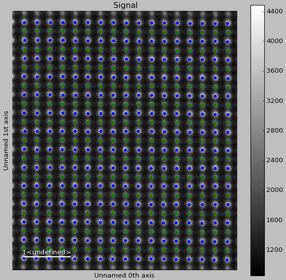

.. _automatation:

============================
Automatation of the analysis
============================

If you are to study many atomic resolution images of the same structure, you can save time and effort by using tools for automatation in Atomap.
The functionality for process parameters (*atomap.process_parameters*)....

Running the analysis on a HAADF image
-------------------------------------

The next step is running the actual processing using the `make_atom_lattice_from_image`,
using the predefined process parameter `PerovskiteOxide110`, and the same signal `s` as earlier.

The process parameter `PerovskiteOxide110` contain various parameters and names for processing
a perovskite oxide structure projected along the [110] direction.

.. code-block:: python

    >>> process_parameter = am.process_parameters.PerovskiteOxide110()
    >>> atom_lattice = am.make_atom_lattice_from_image(s, process_parameter=process_parameter, pixel_separation=16)
    1/2
    2/2
    1/2
    2/2

Depending on the size of the dataset, this can take a while. 
For the test dataset used here it should take about 1 minute.

The processing will:
    1. Locate the most intense atomic columns (Strontium).
    2. Refine the position using center of mass.
    3. Refine the position using 2-D Gaussian distributions
    4. Find the translation symmetry using nearest neighbor statistics, and construct atomic planes using this symmetry.
    5. Locate the second most intense atomic columns (Titanium), using the parameters defined in the model parameters
    6. "Subtract" the intensity of the Strontium from the HAADF image
    7. Refine the position of the Titanium using center of mass
    8. Refine the position of the Titanium using 2-D Gaussian distributions
    9. Construct atomic planes in the same way as for the first sublattice.

This returns an `atom_lattice` object, which contains several utility functions.
For example `get_sublattice_atom_list_on_image` returns a HyperSpy signal which shows all the located atomic positions.

.. code-block:: python

    >>> atom_lattice.get_sublattice_atom_list_on_image().plot()

Sublattices can be accessed using `atom_lattice.sublattice_list`:

.. code-block:: python

    >>> sublattice = atom_lattice.sublattice_list[0]

