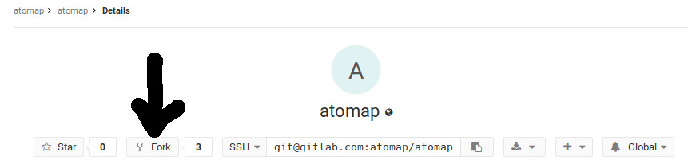

.. _contribute:

====================
Become a contributor
====================

Why contribute
^^^^^^^^^^^^^^

As a scientist, contributing to open source software projects can increase the impact of the code you write.
The tools you help develop can be used by many other researchers, since the tools are freely available for anyone to use.
Often different people will develop tools to do the same type of analysis separately.
This leads to duplicate work, which can be greatly reduced by contributing these tools to an open source project.

Open source software has many advantages:

1. It is better. Since the source code is open, anyone can help finding errors, improving the code and adding functionality. More about that `here <https://www.dwheeler.com/oss_fs_why.html>`__.
2. You can make the tools you want and need, not needing to wait for a company to care.
3. It is for free.

By contributing to open source projects you will gain more experience with programming and how to do software development as a part of a community.

You can check out who is contributing to Atomap `here <https://gitlab.com/atomap/atomap/graphs/master>`__.

What to contribute
^^^^^^^^^^^^^^^^^^

Firstly, as an Atomap user you may find that you miss some functionality.
Obviously, you can develop the tools you are missing, and improve existing tools.
Contributing documentation, and doing language checks is also highly appreciated.
You can read more about contributing to open source projects `here <https://opensource.guide/how-to-contribute/>`__.

Version control
^^^^^^^^^^^^^^^

For software development projects, version control systems are a vital part of the workflow.
Atomap uses Git as version control system.
One version of Atomap is the most `recently released version <https://gitlab.com/atomap/atomap/tree/release>`__, another is the `development version <https://gitlab.com/atomap/atomap/tree/master>`__.
When new functionality is created or old functionality improved, new branches of the development version is typically made.
The branch is merged back into the master development version when it is done.

You only need to know a few basic things about git to be able to start developing.
Git is the most commonly used version control system, so there is a lot of user guides out there.
You may consult the nice GitLab `userguide <https://docs.gitlab.com/ce/gitlab-basics/README.html>`__.
Below, you'll also find and outline of the basic first steps.
Often as with tools, the best way to learn is by using.

First steps: setting up git
^^^^^^^^^^^^^^^^^^^^^^^^^^^

1. Create a user on `GitLab <https://gitlab.com/>`_ and `install <https://gist.github.com/derhuerst/1b15ff4652a867391f03>`__ git on your computer.
2. Make your own fork of Atomap `here <https://gitlab.com/atomap/atomap>`__. Click on the fork button. You need to be logged in.

3. Make ssh-keys for your account on GitLab, see `this guide <https://docs.gitlab.com/ee/gitlab-basics/create-your-ssh-keys.html>`__.
4. Clone the fork to your computer, `as shown here <https://docs.gitlab.com/ce/gitlab-basics/command-line-commands.html#clone-your-project>`__.
   (Use something like ``git clone git@gitlab.com:username/atomap.git``, with your own username).
   This will create a new folder called Atomap, and all the Atomap source code will be inside this folder.
5. You can now install the development version if Atomap by using the terminal.
   Enter the atomap folder in a terminal, and write  ``pip3 install -e .`` (if that doesn't work, try ``pip install -e .``).
6. Type ``git remote -v`` to check the address for your remote origin (your fork on GitLab).
   You can add a link to the upstream version of Atomap by writing ``git remote add upstream git@gitlab.com:atomap/atomap.git``.
   Type ``git remote -v`` again to check if you have registered the address for both remote origin and remote upstream.

Second steps: Adding something
^^^^^^^^^^^^^^^^^^^^^^^^^^^^^^

With git set up and the development version of Atomap installed, you can start adding code.
In this example, spelling errors in the docstring of one function will be fixed.
This is fairly simple and manageable for a first contribution.

1. In the terminal, make a branch for your first development.
   For example a branch for fixing spelling errors, called FixTypos: ``git checkout -b FixTypos``.
   The -b is for creating a new branch.
   Too see what branches you have, write ``git branch``.
   Make sure you are in the correct branch.
   After having the created it, you can switch to this branch through ``git checkout FixTypos``.
2. Fix typos in a file, save.
3. Check what has been changed.
   In the terminal, in the Atomap folder: ``git status``.
   The file you have edited should be listed in red.
   If you want to see what is changed in the files, write ``git status -vv``.
   This shows what is different in the current version compared to the last commit.
4. Add your file to the stage for commit by ``git add filename``
5. Commit your file by ``git commit``.
   Write a short but clear commit message.
   Such as "Fixed typos in docstring in sublattice".
6. Push your commit ``git push origin FixTypos``.
   This synchronizes the changes you have done to your forked remote version on GitLab.
7. When you are ready to add the branch to the Atomap development version, make a request for merging the commit into Atomap.
   See `here <https://docs.gitlab.com/ce/gitlab-basics/add-merge-request.html>`__.

You move from branch to branch with the ``git checkout branch_name`` command.
When starting some new branch, remember to update your master fork by pulling from Atomap (upstream master).

1. Return to your master branch ``git checkout master``
2. Pull the newest changes from Atomap ``git pull upstream master``.

Consult the nice GitLab `userguide <https://docs.gitlab.com/ce/gitlab-basics/README.html>`__.
Google stuff.
Or ask for help `here <https://gitlab.com/atomap/atomap/issues>`__, by adding an `issue <https://docs.gitlab.com/ce/user/project/issues/create_new_issue.html>`__.

Learn more
^^^^^^^^^^

1. HyperSpy's `contribution guide <http://hyperspy.org/hyperspy-doc/current/dev_guide.html#developer-guide>`__: a lot of nice information on how to contribute to a scientific Python project.
2. `What is git? <https://www.git-scm.com/about>`__
3. Atomap follows the Style Guide for Python Code. These are just some rules for consistency that you can read all about in the `Python Style Guide <https://www.python.org/dev/peps/pep-0008/>`__.
4. `Writing tests <http://hyperspy.org/hyperspy-doc/current/dev_guide.html#write-tests>`__.
5. `Writing documentation <http://hyperspy.org/hyperspy-doc/current/dev_guide.html#write-documentation>`__.
6. The Python programming language, `for beginners <https://www.python.org/about/gettingstarted/>`__.
