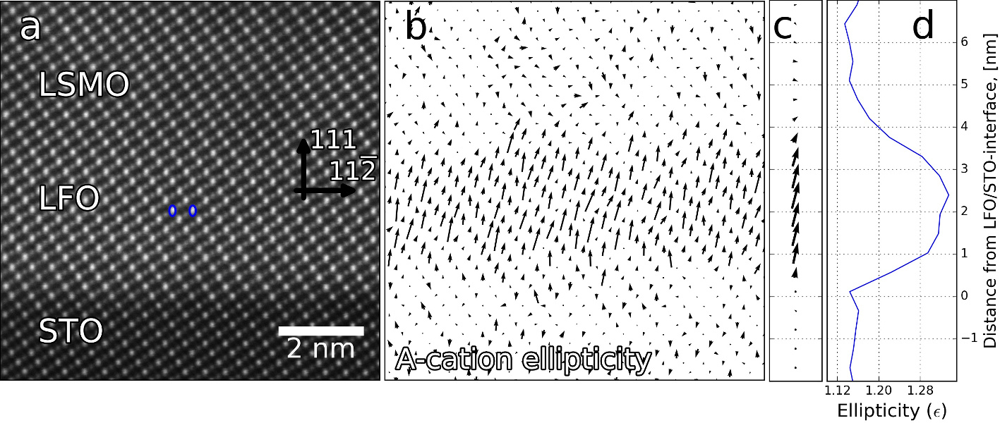
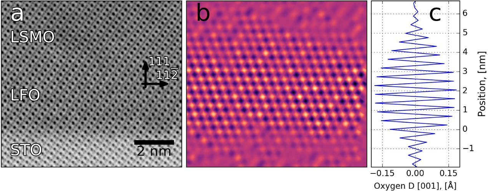

Welcome to Atomap's documentation!
==================================

News
----
**2017-11-16: Atomap 0.1.0 released!**

We are happy to announce a new Atomap release.
It includes a **major makeover** of the tutorial, start with :ref:`finding_atom_lattices`.
New features in this release are methods for finding atomic column intensity, new and simple plotting tools and a module for generating test data.

*2017-07-03: version 0.0.8 released!*

New features: ability to process dumbbell structures, fitting of multiple 2D Gaussians at the same time, improved background subtraction during 2D Gaussian fitting, and processing of nanoparticles.

About Atomap
------------
Atomap is a Python library for analysing atomic resolution scanning transmission electron microscopy images.
It relies in fitting 2-D Gaussian functions to every atomic column in an image, and automatically find all major symmetry
axes. The full procedure is explained in the article `Atomap: a new software tool for the automated analysis of
atomic resolution images using two-dimensional Gaussian fitting <https://dx.doi.org/10.1186/s40679-017-0042-5>`_.

    Measuring the ellipticity of atomic columns. `More info <https://ascimaging.springeropen.com/articles/10.1186/s40679-017-0042-5#Fig6>`_

    Mapping the variation in distance between oxygen columns. `More information <https://ascimaging.springeropen.com/articles/10.1186/s40679-017-0042-5#Fig5>`_

Atomap is under development and still in alpha, so bugs and errors can be expected.
Bug reports and feature requests are welcome on the `issue tracker <https://gitlab.com/atomap/atomap/issues>`_.
Contributors are welcome too!

If you publish scientific articles using Atomap, please consider citing the article `Atomap: a new software tool for the automated analysis of
atomic resolution images using two-dimensional Gaussian fitting <https://dx.doi.org/10.1186/s40679-017-0042-5>`_.
(*M. Nord et al, Advanced Structural and Chemical Imaging 2017 3:9*)

Atomap is available under the GNU GPL v3 license.
The source code is found in the `GitLab repository <https://gitlab.com/atomap/atomap/tree/master/>`_.

Contents on this webpage
------------------------

.. toctree::
   :maxdepth: 2

   install
   start_atomap
   finding_atom_lattices
   analysing_atom_lattices
   automation
   nanoparticle_example
   make_testdata
   making_nice_figures
   various_tools
   contribute
   development_guide
   api_documentation

* :ref:`genindex`
* :ref:`modindex`

Old news
--------

