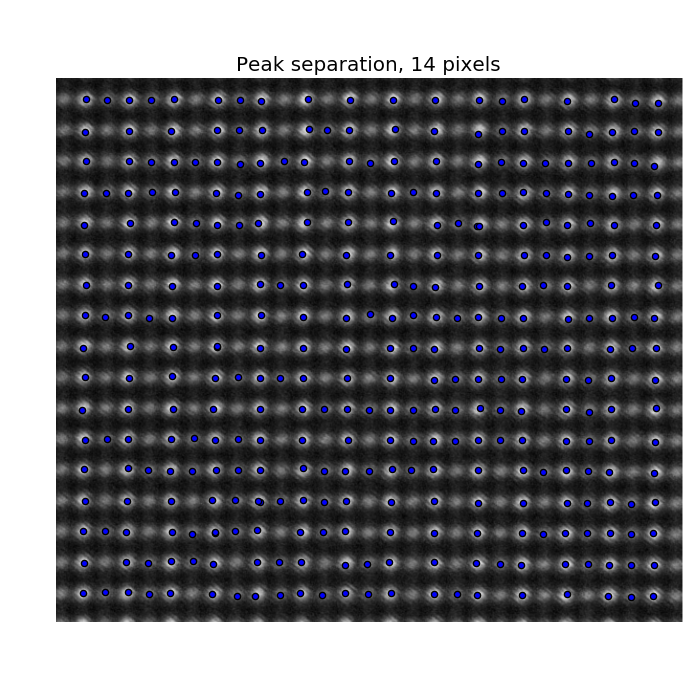
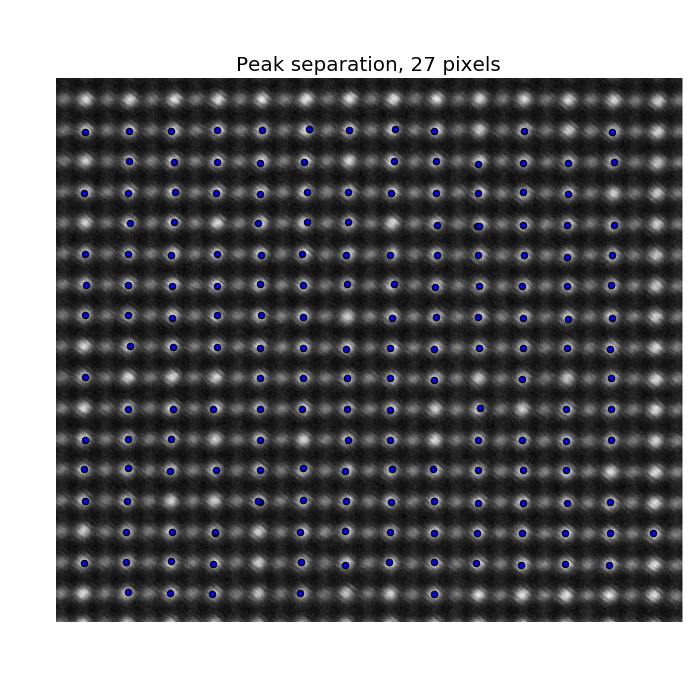
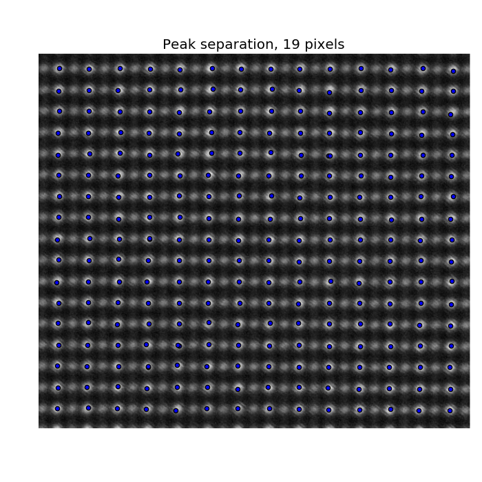
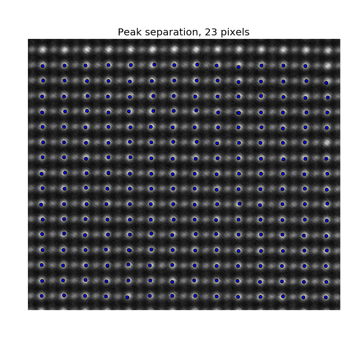
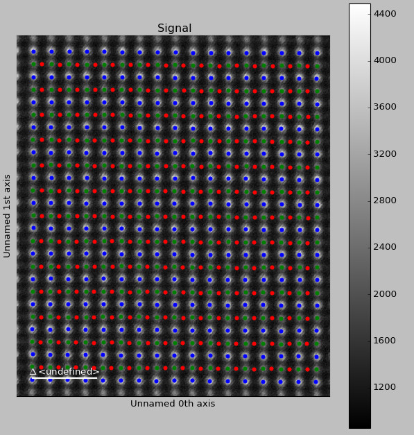

.. _tutorial:

========
Tutorial
========

Starting Python
---------------

The first step is starting an interactive Python environment (IPython).

Linux
^^^^^

Open a terminal and start `ipython3`:

.. code-block:: bash

    $ ipython3

If `ipython3` is not available, try `ipython`:

.. code-block:: bash

    $ ipython

Windows
^^^^^^^

This depends on the installation method.
If Anaconda was used, there should be an *Anaconda3* folder in the start menu.
Start the interactive Python environment, it should be called either *IPython* or *Jupyter QtConsole*.
This will open a command line prompt.
This prompt will be referred to as the *IPython terminal*.

Getting test data
-----------------

Atomap generates many image files for data visualization, so it is recommended to do all the work in a separate folder.
The `>>>` used in the documentation means the comment should be typed inside some kind of Python prompt, so do not include these when actually running the code.
So for the first command below, only `mkdir atomap_testing` should be typed or copied into the IPython terminal.
In the IPython terminal:

.. code-block:: python

    >>> mkdir atomap_testing
    >>> cd atomap_testing

Firstly we need to download some test datasets from the Atomap repository:

.. code-block:: python

    >>> import urllib.request
    >>> urllib.request.urlretrieve("https://gitlab.com/atomap/atomap/raw/master/atomap/tests/datasets/test_ADF_cropped.hdf5", "test_ADF_cropped.hdf5")

This will grab a data file with a High Angle Annular Dark Field image of SrTiO3 projected along the [110] zone axis.
The file should appear in our current folder:

.. code-block:: python

    >>> ls
    test_ADF_cropped.hdf5

Finding the peak separation
----------------------------

For Atomap to do its analysis two parameters are needed: the peak separation for the first sublattice, and a calibrated dataset.
Getting the peak separation is done using the `plot_feature_separation` function:

.. code-block:: python

    >>> import hyperspy.api as hs
    >>> s = hs.load("test_ADF_cropped.hdf5")
    >>> from atomap.atom_finding_refining import plot_feature_separation
    >>> plot_feature_separation(s) 

This will generate several image files called *peak_separation_XYZ.png* in the folder we created earlier.
The *XYZ* refer to the peak separation between the features in the image.
The path to this folder will vary depending on what operating system you are using, and can be retrieved by:

.. code-block:: python

    >>> pwd

In Windows this will output something like *C:\\Users\\YOURUSERNAME\\Documents\\atomap_testing*.
And in Linux this output will (probably) be something like *'/home/magnunor/Desktop/atomap_testing'*.
Go to this folder and open one of the images, which should look like:

The requirements for the peak separation are:
    1. With an optimal peak separation, only atoms from one sublattice should be marked.
    2. In addition, all the atoms from the first sublattice should be marked.
So the peak separations shown in the two images above is not good.

It should look something like this:

Note, requirement 2 does not extend to the edges, so this would also work:

For this dataset we chose a peak separation of 19 pixels

This procedure will probably be automated at some point in the future.

Running the analysis on a HAADF image
-------------------------------------

The next step is running the actual processing using the `make_atom_lattice_from_image`,
using the predefined model parameter `PerovskiteOxide110`, and the same signal `s` as earlier.

The model parameter `PerovskiteOxide110` contain various parameters and names for processing
a perovskite oxide structure projected along the [110] direction.

.. code-block:: python

    >>> from atomap.main import make_atom_lattice_from_image
    >>> from atomap.process_parameters import PerovskiteOxide110
    >>> model_parameters = PerovskiteOxide110()
    >>> atom_lattice = make_atom_lattice_from_image(s, model_parameters=model_parameters, pixel_separation=19)

Depending on the size of the dataset, this can take a while. 
For the test dataset used here it should take about 1 minute.

The processing will:
    1. Locate the most intense atomic columns (Strontium).
    2. Refine the position using center of mass.
    3. Refine the position using 2-D Gaussian distributions
    4. Find all the major symmetry axes using nearest neighbor statistics
    5. Locate the second most intense atomic columns (Titanium), using the parameters defined in the model parameters
    6. "Subtract" the intensity of the Strontium from the HAADF image
    7. Refine the position of the Titanium using center of mass
    8. Refine the position of the Titanium using 2-D Gaussian distributions
    9. Find all the major symmetry axes for the Titanium using nearest neighbor statistics

Various debugging images are saved in a folder in the same location as the image file.
So with the `test_ADF_cropped.hdf5` data file, the folder will be `atomap_testing/test_ADF_cropped`.

This returns an `atom_lattice` object, which contains several utility functions.
For example `plot_all_sublattices`, which plots all the atom column positions
on the image:

.. code-block:: python

    >>> atom_lattice.plot_all_sublattices()

This is saved as an image file ("all_sublattice.jpg").

Sublattices can be accessed using `atom_lattice.sublattice_list`:

.. code-block:: python

    >>> sublattice = atom_lattice.sublattice_list[0]

These `sublattice` objects contain a large amount of information about
the atomic columns:

.. code-block:: python

    >>> sublattice.x_position
    >>> sublattice.y_position
    >>> sublattice.sigma_x
    >>> sublattice.sigma_y
    >>> sublattice.ellipticity
    >>> sublattice.rotation

These can be saved in different formats such as Numpy npz file:

.. code-block:: python

    >>> import numpy as np
    >>> np.savez("datafile.npz", x=sublattice.x_position, y=sublattice.y_position)

Or comma-separated values (CSV) file, which can be opened in spreadsheet software:

.. code-block:: python

    >>> np.savetxt("datafile.csv", (sublattice.x_position, sublattice.y_position, sublattice.sigma_x, sublattice.sigma_y, sublattice.ellipticity), delimiter=',')

`sublattice` objects also contain a several plotting functions.
These functions saves the images in the data processing folder mentioned earlier (`atomap_testing/test_ADF_cropped`).
Since the image is from a SrTiO3 single crystal, there should be no variations in the structure.
So any variations are due to factors such as scanning noise, drift and possibly bad fitting.

.. code-block:: python

    >>> sublattice.plot_monolayer_distance_map()
    >>> sublattice.plot_ellipticity_map()

The `sublattice` objects also contain a list of all the atomic planes and the atomic positions:

.. code-block:: python

    >>> sublattice.atom_plane_list
    >>> sublattice.atom_list

The `atom_plane` objects contain the atomic columns belonging to the same specific plane.
Atom plane objects are defined by the direction vector parallel to the atoms in the plane, for example (58.81, -41.99).
These can be accessed by:

.. code-block:: python

    >>> atom_plane = sublattice.atom_plane_list[0]
    >>> atom_plane.atom_list

These `atom_position` objects contain information related to a specific atomic column.
For example:

.. code-block:: python

    >>> atom_position = sublattice.atom_list[0]
    >>> atom_position.pixel_x
    >>> atom_position.pixel_y
    >>> atom_position.sigma_x
    >>> atom_position.sigma_y

Basic information about the `atom_lattice`, `sublattice`, `atom_plane` and `atom_position` objects can be accessed by simply:

.. code-block:: python

    >>> atom_lattice
    <Atom_Lattice, test_ADF_cropped (sublattice(s): 2)>
    >>> sublattice
    <Sublattice, test_ADF_cropped.A (atoms:237,planes:7)>
    >>> atom_plane
    <Atom_Plane, (29.14, -0.18) (atoms:17)>
    >>> atom_position
    <Atom_Position,  (x:26.1,y:404.7,sx:4.4,sy:5.1,r:0.2,e:1.2)>

The `atom_lattice` object with all the atom positions can be saved:

.. code-block:: python

    >>> atom_lattice.save_atom_lattice()

This will make a HDF5-file in the data processing folder (`atomap_testing/test_ADF_cropped`) called `atom_lattice.hdf5`.
The `atom_lattice` object can then be restored using:

.. code-block:: python

    >>> from atomap.io import load_atom_lattice_from_hdf5
    >>> atom_lattice_1 = load_atom_lattice_from_hdf5("test_ADF_cropped/atom_lattice.hdf5")

This is especially useful for large datasets, where refining the atomic positions can take a long time.

Finding the oxygen columns
--------------------------

Atomap can also find the positions of oxygen columns in an Annular Bright Field (ABF) image, by firstly using a ADF image.
We use the same ADF image as earlier, in addition to an ABF image acquired simultaneously:

.. code-block:: python

    >>> urllib.request.urlretrieve("https://gitlab.com/atomap/atomap/raw/master/atomap/tests/datasets/test_ADF_cropped.hdf5", "test_ADF_cropped.hdf5") 
    >>> s = hs.load("test_ADF_cropped.hdf5")
    >>> urllib.request.urlretrieve("https://gitlab.com/atomap/atomap/raw/master/atomap/tests/datasets/test_ABF_cropped.hdf5", "test_ABF_cropped.hdf5") 
    >>> s_abf = hs.load("test_ABF_cropped.hdf5")
    >>> model_parameters = PerovskiteOxide110()
    >>> atom_lattice = make_atom_lattice_from_image(s, model_parameters=model_parameters, pixel_separation=19, s_image1=s_abf)
    >>> atom_lattice
    <Atom_Lattice, test_ADF_cropped (sublattice(s): 3)>

The oxygen `sublattice` has been added to the `atom_lattice`.
This new `sublattice` can be visualized using `plot_all_sublattices`, where we use the `markersize` parameter to make the circles indicating the atomic column positions bigger:

.. code-block:: python

    >>> atom_lattice.plot_all_sublattices(markersize=7)

